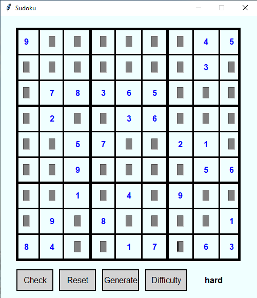

# SudokuSolver

Sudoku solver is project, whose task is to create library which will generate solved sudoku a then creates solvable sudoku by special algoritm. This algoritm is inspired by work that is referenced down below. Except library, there will be created a console and graphical interface, to play and enjoy sudoku.

To achiave this goal, i choosed a python as a main programing language, because its quick, and easy to understand for other people, who would be interested to try it program by them self. The reason why i start to do this project is because i wanted to learn python to some level and i thing, sudoku is perfect project , if you have some experiences with programing.

What is my way for creating sudoku puzzle ?

For solving sudoku, i use adjusted backtracking algoritm. But first there is need to create some start up grid and fill it with few numbers to random positions.This numbers are filled only to first tree regions, because of lower time (otherwise it would last forever to complete puzzle), in which backtracking algoritm will fill sudoku.You may argue, that this method will lower a number of combinations for creating sudoku (or will be easy), but when i tried testing it over night by brute force technique, it didnt found same solution. 

Next important task was to create playable sudoku from complete one. In this case, i used technique from resource bellow, where is exactly specified, how many cells is left for specific difficulty. For this task i used my algoritm, which iterates every region and randomly deletes one cells. Number of passages is intended by difficulty. Its very basic algoritm, and i will do my best to improve him by other rules from document below, but in conclusion, algoritm is now very effective and can produce very, very hard solutions (tested) where there is only one way, to finish them.

5.2.2020

In this state, library for creating sudoku is finished, very basic console app is produce (mainly for testing), and all effort 
directs to completion of graphical app for playing sudoku.

11.3.2020

GUI for sudoku is finished and functional. You now can play sudoku, generate solution by difficulty etc...
You can see final design on the picture below.

Resources and inspiration:

http://zhangroup.aporc.org/images/files/Paper_3485.pdf

Warning:

This project was created for research purposes a can contain many errors, that may, or may not be repaired in the future.

By the way,
Sorry for my bad english and imperfections in code, on day, i will fix them :)

